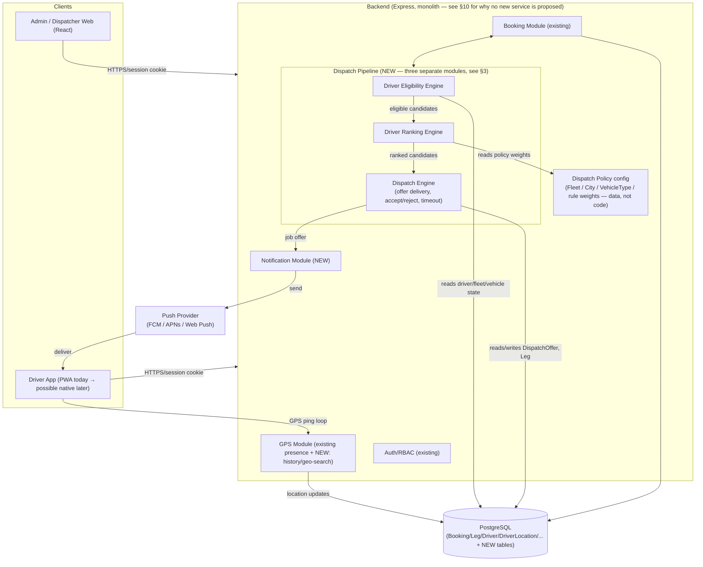
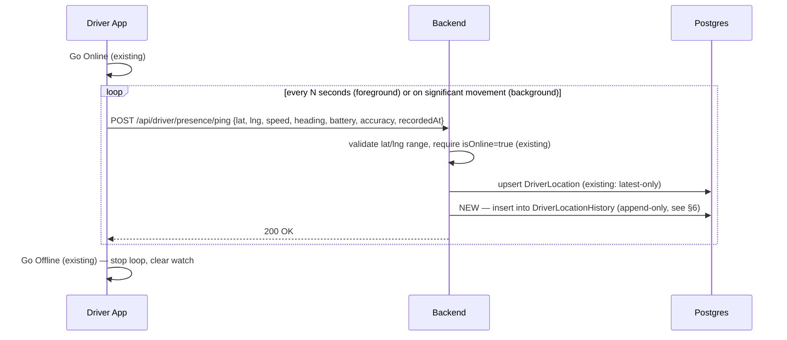
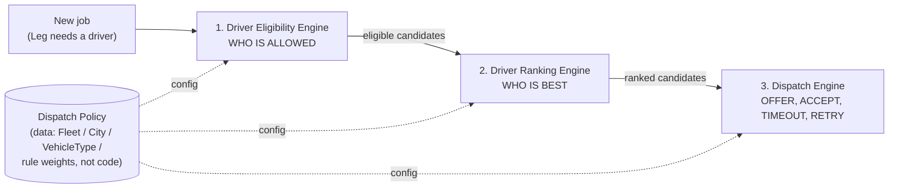
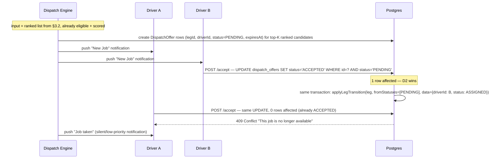
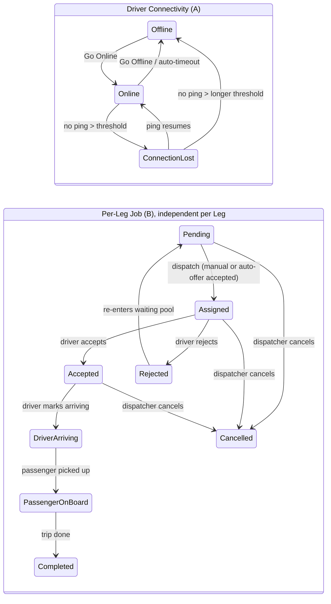
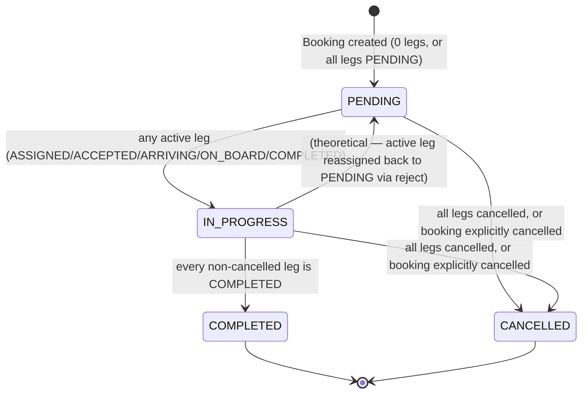
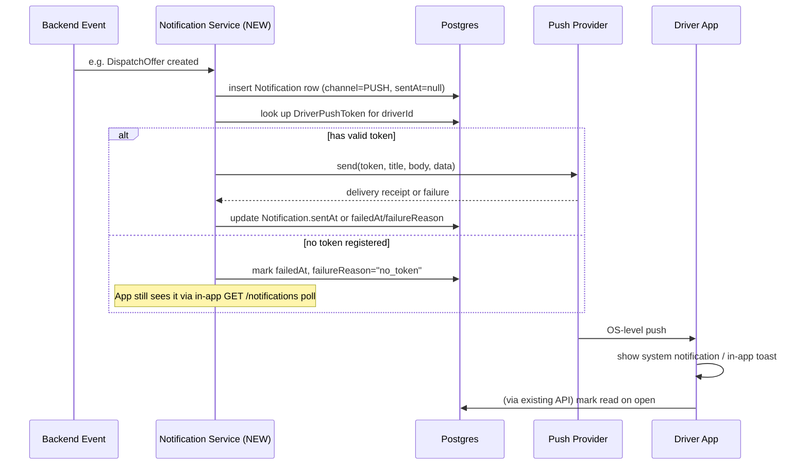

# Phase 2 — GPS & Dispatch Architecture (Design Only)

Status: **Draft for review — no code, no schema, no migration in this phase.**
Scope: everything below is a proposal. Nothing here changes existing Booking Module V1 behavior, which has passed UAT and stays untouched until this document is approved section by section.

## 0. What already exists today (read this before the rest)

Phase 2 is not starting from zero. A first-generation GPS/Dispatch layer was already built and is live in production. Any new design has to either extend this or explicitly say what it replaces — silently duplicating it would create two sources of truth.

**Already implemented, in production:**

- **Schema**: `Driver.isOnline` / `Driver.onlineSince` (manual online flag), `DriverLocation` — one row per driver, upsert-only, no history (`apps/backend/prisma/schema.prisma:252-294`).
- **Presence computation**: `computePresenceStatus()` in [gps.service.ts](apps/backend/src/modules/gps/gps.service.ts) — pure function, derives `OFFLINE / CONNECTION_LOST / ONLINE / <active leg status>` from `isOnline`, `onlineSince`, last GPS `receivedAt`, and configurable thresholds (`CompanySettings.connectionLostTimeoutSeconds`, `offlineTimeoutSeconds`).
- **GPS APIs**: `POST /api/driver/presence/{online,offline,ping}`, `GET /api/driver/presence/me`, `GET /api/admin/gps/drivers[/:id]`.
- **Dispatch Center (Admin)**: `GET /api/admin/dispatch/{waiting-bookings,drivers,statistics}` — a **read-only aggregation view** over existing Booking/Leg/Driver/DriverLocation data. It shows waiting bookings, driver workload/GPS status, and lets a dispatcher **manually** assign a driver via the existing `assignDriver` API. There is no distance calculation, no "nearby driver" ranking, no auto-assignment, no accept/reject race logic beyond the existing per-leg state machine.
- **Driver state machine (per Leg, not per Driver)**: `PENDING → ASSIGNED → ACCEPTED → DRIVER_ARRIVING → PASSENGER_ON_BOARD → COMPLETED`, with `REJECTED` and `CANCELLED` as side branches. Implemented via `applyLegTransition()` — a single conditional `UPDATE ... WHERE status IN (...)` that atomically prevents double-transition races ([legTransition.ts](apps/backend/src/modules/bookings/legTransition.ts)).
- **Booking lifecycle**: derived, not stored — `deriveBookingStatus()` recomputes `PENDING/IN_PROGRESS/COMPLETED/CANCELLED` from the current set of Leg statuses every time a Leg changes ([bookings.status.ts](apps/backend/src/modules/bookings/bookings.status.ts)).
- **Frontend**: Driver PWA (installable, `manifest.json`, no service worker) with Go Online/Offline switch, background `setInterval` GPS upload loop, Job list with Accept/Reject/Arriving/OnBoard/Complete buttons. Admin GPS Dashboard (list view, no map). Dispatch Center (Tabs: Waiting / Drivers / Active).

**What Phase 2 genuinely adds (not yet built anywhere):**

1. Location **history** (current schema keeps only the latest point).
2. **Distance-based nearby-driver search** (current dispatch has zero geo-math — it's a workload/status list, not a map).
3. **Automatic dispatch** — offer a job to a driver (or a ranked set of drivers) without a human clicking "assign," including timeout + re-offer.
4. **First-accept-wins** concurrency when a job is offered to more than one driver at once (today, `assignDriver` always targets exactly one specific driver chosen by a human — there is no "offer to N, first wins" concept at all).
5. **Push notifications** (nothing exists today — no APNs/FCM integration, no notification table, no in-app push permission flow).
6. A **live map** (Dashboard is a table today).
7. A **native or map-capable driver app** beyond the current PWA (current PWA has no map/turn-by-turn).

Sections 1–10 below design these seven additions on top of the existing foundation — reusing existing tables/enums/permission patterns wherever they already fit, and only introducing new ones where the existing model has no answer.

---

## 1. Overall System Architecture



**Why no new backend service/process is proposed:** the current backend is a single Express app with ~13 route-mounted modules sharing one Prisma client and one Postgres database (`apps/backend/src/app.ts`). Every existing module (Wallet, Settlement, Collection, Revenue Sharing) was added the same way: new Prisma models + new `*.service.ts`/`*.controller.ts`/`*.routes.ts` triplet + mount in `app.ts`. GPS/Dispatch/Notification should follow the identical pattern — introducing a separate microservice, message queue, or second database at this stage would be solving a scale problem this system doesn't have yet, and would break the one invariant every existing module relies on: that Booking/Leg/Wallet writes inside one request can share a single Prisma transaction (see `driverJobs.service.ts` `completeLeg` — Leg completion and wallet payout must be atomic; a network hop between services would make that harder, not easier).

**Why Dispatch is drawn as three modules, not one** (added after review — see §3 for the full design): Eligibility, Ranking, and Dispatch are three separate `*.service.ts` files with a one-directional data flow (candidates → eligible → ranked → offered), not three layers inside one `dispatch.service.ts`. This is still "no new process" — it's a code-organization decision, not an infrastructure one — but it's called out at the architecture level because it's the seam that lets business rules (which drivers qualify, how they're scored) evolve per fleet/city/company without ever touching the offer/accept/timeout mechanics in the Dispatch Engine itself.

The one place a background process is unavoidable is **notification delivery** (§9) and **stale-driver cleanup** (§2) — both are proposed as an in-process scheduled job (`setInterval` inside the existing backend, same pattern already used nowhere yet in this codebase but consistent with how simple the rest of the system is), not a separate worker fleet, until real load proves that wrong.

---

## 2. GPS Architecture

### 2.1 What stays as-is
- Driver toggles Online/Offline manually (`isOnline` boolean) — kept. Auto-detecting "online" from GPS alone is a worse UX (driver forgets they're online, keeps burning battery).
- `computePresenceStatus()`'s pure-function design — kept and extended, not replaced. It already correctly handles the "stale location survives going offline" class of bug (see the Round-2 comment in the code) and already reads thresholds from `CompanySettings` instead of hardcoding them.

### 2.2 Driver location update flow



### 2.3 Update interval
- **Foreground, actively on a job** (`ACCEPTED`/`DRIVER_ARRIVING`/`PASSENGER_ON_BOARD`): every **5 seconds** — matches the existing `CompanySettings.gpsUploadIntervalSeconds` default and is already wired end-to-end.
- **Foreground, online but idle** (waiting for a job): every **15–20 seconds**. No point burning battery at 5s cadence when nothing is happening; the dispatch engine's nearby-search only needs "roughly where is this driver," not sub-minute precision, when idle.
- **Background** (see §2.5): interval-based background updates are unreliable on iOS Safari PWAs (no `Geolocation.watchPosition` guarantee once backgrounded, no Background Sync API support in Safari). Proposal: rely on **significant-location-change** semantics where the platform supports it, and treat "no ping in `offlineTimeoutSeconds`" as already-handled (existing auto-offline logic) rather than trying to force background reliability the web platform can't guarantee on iOS.
- All three numbers should be **CompanySettings-driven**, not hardcoded — same pattern as the existing `gpsUploadIntervalSeconds`. Proposal: split it into `gpsUploadIntervalActiveSeconds` / `gpsUploadIntervalIdleSeconds`.

### 2.4 Online / Offline state
No change to the state itself. What's new: the **dispatch engine needs to distinguish "online + idle" from "online + busy"** to know who's eligible for a new job offer. That distinction already exists implicitly in `listDispatchDrivers()` (`workloadStatus: BUSY | IDLE`, based on `UNFINISHED_LEG_STATUSES` count) — the auto-dispatch engine in §3 reuses that exact query, it does not need a new "driver state" column.

### 2.5 Background updates
Being upfront about a real constraint: this is a mobile-web PWA (confirmed — no native shell, no `apps/mobile` directory, no Capacitor/React Native anywhere in the repo), not a native app. On iOS Safari specifically:
- A backgrounded PWA tab is suspended; `setInterval`-based GPS loops **stop** running.
- There is no reliable "wake up periodically in the background" API for home-screen web apps on iOS today.
- The **honest options** are: (a) accept that GPS is foreground-only and the "online" flag + last-known-location is what dispatch works with when the app isn't in the foreground (current behavior, degrades gracefully via `CONNECTION_LOST`/`OFFLINE` presence states that already exist); or (b) move to a native shell (Capacitor wrapping the existing React app is the smallest jump — reuses 100% of current frontend code — and gets real background location + push notification entitlements). **This document does not decide (a) vs (b) yet** — it's flagged as the single biggest open question before Phase 2.5/2.6 (Driver App / Push Notification) can be built for real, and is called out again in §10 as a decision gate.

### 2.6 Battery considerations
- Idle-interval throttling (§2.3) is the primary lever.
- `batteryPercent` is already a field on `DriverLocation` (uploaded, not yet surfaced anywhere in the UI) — proposal: surface it on the Admin GPS Dashboard driver row so dispatchers can see "driver is at 8%, might go dark soon" before it happens, and stop treating it as write-only data.
- Do not request `enableHighAccuracy: true` GPS when idle — only when actively navigating to a pickup (`DRIVER_ARRIVING`). High-accuracy GPS is the single biggest battery cost on mobile browsers.

### 2.7 Accuracy handling
- The browser Geolocation API returns an `accuracy` field (meters, 1-sigma radius) that is **not currently captured** anywhere (`DriverLocation` has no accuracy column). Proposal: add it (§6) and have the Eligibility/Ranking Engines (§3.1/§3.2) treat any ping with `accuracy > 100m` as low-confidence — still store it, but don't let it flip a driver from "far" to "near" in ranking on its own; wait for the next ping.
- GPS drift while stationary (parked driver "jumping" 20-30m between pings) should be smoothed client-side by ignoring pings where `speed` reported by the device is near-zero and the position delta is within the reported accuracy radius — i.e., don't even send a ping if nothing meaningfully changed. This also reduces network/battery cost for free.

---

## 3. Dispatch Engine

### 3.0 Design principle: three separate engines, not one

*(Revised after review — this section originally described one `dispatch.service.ts` doing candidate search, ranking, and offer delivery in a single pass. That version is replaced by the design below.)*

Job-matching is split into three strictly ordered, independently-owned stages, each its own module (its own `*.service.ts`, its own tests, its own reason to change):



The reason for the split, stated directly: **"who is allowed" and "who is best" are business policy — they change per fleet, per city, per partner contract, per VIP tier, per season. "How do we deliver an offer and resolve a race" is a mechanical, structural concern that should never change no matter how many fleets or cities exist.** Mixing the two means every new business rule (a partner fleet's contract terms, a VIP customer's dispatch priority, a new city's radius) becomes a change to the same file that also has to get accept/reject/timeout/retry exactly right — which is both a correctness risk (a rule change breaking the race-safety logic) and a scaling risk (the file becomes an unreviewable pile of `if` statements as the business grows). Separating them means the Dispatch Engine can be written once, tested once for its concurrency correctness, and never touched again as the business adds fleets, cities, or rules — only Eligibility rules and Ranking weights change, and those are the parts designed to change (§3.8).

> ### Scope note — Phase 1 vs. Future Extension (added after review)
>
> The three-engine **separation** below is the permanent architecture and is fully implemented in Phase 1. What is *deliberately minimal* in Phase 1 is the **content** inside each engine — how many rules Eligibility checks, how many criteria Ranking scores by. The real, current business need is simple: most customers are regular, the fleet already knows the jobs, and the goal is replacing manual phone calls/messages with automatic offers a driver can accept or reject. Phase 1 implements exactly that and nothing more. Everything discussed in the two prior review rounds beyond this — fleets, cities, vehicle types, VIP/female-driver/child-seat/wheelchair/pet-transport requirements, acceptance-rate/cancellation-rate/senior-driver scoring, configurable rule builders — is captured **only as reserved extension points** (unused fields, empty rule/criterion arrays, a deferred schema section in §6) and is explicitly **not built** in Phase 1. See the Phase 1 / Future split called out under each of §3.1, §3.2, and §3.8 below.

Each engine's contract:

```typescript
// 1. Eligibility Engine — a pure filter. Answers ONE question: is this driver
// allowed to even see this offer? No scoring, no ordering — just in/out.
interface EligibilityContext {
  legId: number;
  pickupLatitude?: number;          // optional in V1 — distance ranking only runs when present
  pickupLongitude?: number;
  excludeDriverIds: number[];       // already declined/timed-out this Leg (re-dispatch/waves, §3.7)

  // Reserved for Future Extension (§3.8) — always undefined/empty in Phase 1, read by
  // zero Phase 1 rules. Kept on the interface now so turning them on later is passing
  // real values in, not redesigning the contract.
  requiredVehicleTypeId?: number;
  fleetScope?: number[];
  cityId?: number;
  policy?: DispatchPolicy;
}

interface EligibilityRule {
  name: string; // Phase 1: "ACTIVE_STATUS", "ONLINE_AVAILABLE", "NO_OVERLAPPING_ACTIVE_JOB".
                // Future Extension only (§3.8, not implemented in V1): "FLEET_MEMBERSHIP",
                // "VEHICLE_TYPE_MATCH", "CITY_MATCH", "WITHIN_RADIUS", "REQUIREMENT_SATISFIED".
  isSatisfiedBy(candidate: DriverCandidate, ctx: EligibilityContext): boolean;
}

function findEligibleDrivers(ctx: EligibilityContext, rules: EligibilityRule[]): DriverCandidate[];

// 2. Ranking Engine — a pure scorer. Takes ONLY drivers Eligibility already
// approved. Never re-checks eligibility, never has its own opinion about who's
// "allowed" — that question was already answered upstream.
interface RankingCriterion {
  name: string; // Phase 1: "DISTANCE" (only criterion that actually ships).
                // Future Extension only (§3.8): "FAIRNESS_COMPLETED_TODAY", "FLEET_PRIORITY",
                // "VIP_TIER", acceptance-rate/cancellation-rate/senior-driver scoring.
  score(candidate: DriverCandidate, ctx: EligibilityContext): number; // normalized 0..1
  weight: number; // Phase 1: DISTANCE weight = 1 (sole criterion). Future: from
                   // policy.rankingConfig once DispatchPolicy exists — not a code constant.
}

function rankDrivers(eligible: DriverCandidate[], ctx: EligibilityContext, criteria: RankingCriterion[]): RankedDriver[];

// 3. Dispatch Engine — mechanical only. Has ZERO knowledge of what "eligible" or
// "best" means. Takes an already-ranked list, decides how many to offer at once
// (a small configurable wave size — simple CompanySettings-style number in V1, not
// policy.maxOfferBatchSize, since DispatchPolicy itself is Future Extension),
// creates DispatchOffer rows, manages the state machine (§3.3-§3.7). If it needs a
// NEXT wave, it calls back into #1 and #2 — it never invents its own candidate list.
function dispatchToDrivers(rankedCandidates: RankedDriver[], ctx: EligibilityContext): Promise<DispatchOffer[]>;
```

### 3.1 Driver Eligibility Engine

Answers: **which drivers are allowed to receive this offer at all.** Implemented as an ordered list of small, independently testable predicate functions (`EligibilityRule[]`) run against a candidate pool — reusing the existing `listDispatchDrivers()`-style query (driver + latest `DriverLocation` + workload counts) as the *source* of candidates, before any rule filtering happens.

**A. Phase 1 — implemented now.** Three rules, each with a direct existing-code equivalent (nothing new to invent, only extracted into a named, pluggable rule), directly matching the approved core requirements:
- `ACTIVE_STATUS` — `driver.status === "ACTIVE"` (existing field, existing check pattern from `assignDriver`'s `assertDriverAssignable`). *(core rule #1)*
- `ONLINE_AVAILABLE` — presence = `ONLINE` via the existing `computePresenceStatus` **and** `workloadStatus === "IDLE"` (existing, from `listDispatchDrivers`) — combined into one rule because for Phase 1 "online" and "available" are the same practical question: is this driver currently free to receive an offer. *(core rule #2)*
- `NO_OVERLAPPING_ACTIVE_JOB` — driver has zero legs in `UNFINISHED_LEG_STATUSES` (existing enum, existing query). This is really the same underlying check as `ONLINE_AVAILABLE`'s workload half, kept as an explicitly separate named rule because it's the one the business specifically called out (core rule #3) and it's worth being able to test/reason about on its own. *(core rule #3)*

Also always active in Phase 1, not business-rule-gated: `NOT_ALREADY_OFFERED_THIS_WAVE` — `driver.id ∉ ctx.excludeDriverIds`, i.e. a driver who already declined or timed out on this specific Leg isn't offered it again in the next wave (§3.7).

**B. Future Extension — not included in V1.** Named and reserved on the `EligibilityRule` type, not implemented, not called by any Phase 1 code path:
- `WITHIN_RADIUS` — hard-cutoff search radius. Not needed for V1 since Phase 1 doesn't filter by distance at all, only *ranks* by it (§3.2) — every online, available, non-overlapping driver is eligible regardless of distance; how far they are only affects the order they're offered in.
- `FLEET_MEMBERSHIP`, `VEHICLE_TYPE_MATCH`, `CITY_MATCH` — depend on the `Fleet`/`City`/`VehicleType` schema in §6.3b, which is itself Future Extension. Explicitly the "complex fleet priority" and multi-city scope the user asked to defer.
- `REQUIREMENT_SATISFIED` — the booking-requirement/driver-capability matching discussed in the prior review round (VIP, female driver, airport certification, child seat, wheelchair, pet transport, and any future custom requirement). Fully designed conceptually (a `RequirementType` reference table + `BookingRequirement`/`DriverCapability` join tables, consumed by one generic rule — see the prior turn's evaluation) but **explicitly out of scope for Phase 1** per the scope reduction. Not built, not scheduled, revisit only when a real requirement of this kind is actually needed.

### 3.2 Driver Ranking Engine

Answers: **of the eligible drivers, which should be offered the job first.** Takes the Eligibility Engine's output as its only input — it does not re-derive who's allowed, and it must never be able to rank a driver back *in* who Eligibility excluded (enforced by the type signature: `rankDrivers` only accepts `DriverCandidate[]` that already passed `findEligibleDrivers`, not a raw driver list).

**A. Phase 1 — implemented now.** One criterion:
- `DISTANCE` (weight = 1, sole criterion) — Haversine distance from driver's last known `DriverLocation` to the Leg's pickup point, closer ranks first. *(core rule #4 — "rank mainly by distance when GPS is available")*
- **When GPS/pickup coordinates aren't available** (either the driver has no recent location ping, or the Leg has no pickup coordinates — see §6.7, still an open capture-method question), `DISTANCE` can't be computed for that candidate. Phase 1 handling: fall back to a simple, non-scored deterministic order (e.g. ascending `completedToday`, purely as a tiebreaker so the wave isn't literally random — not a fairness *algorithm*, just "some stable order," which is the honest minimum the requirement asks for). This fallback is intentionally not dignified with its own named `RankingCriterion` — it's a default, not a rule.

**B. Future Extension — not included in V1.** Named and reserved on the `RankingCriterion` type, not implemented:
- `FAIRNESS_COMPLETED_TODAY` as a real weighted, scored criterion (distinct from the plain tiebreaker above) — this is the "advanced fairness scoring" the user asked to defer.
- `FLEET_PRIORITY`, `VIP_TIER` — depend on Future Extension schema (§3.8, §6.3b).
- Acceptance-rate scoring, cancellation-rate scoring, senior-driver scoring — none of the underlying data (historical accept/decline/cancel rates, driver tenure) is tracked anywhere in the schema today; out of scope until it is, and out of scope for Phase 1 regardless.

Manual override stays available regardless of ranking, in both Phase 1 and every future extension: the existing `assignDriver` API (a human picking a specific driver) is not replaced by this pipeline — it's an escape hatch a dispatcher can always use instead of, or after cancelling, an auto-dispatch wave. *(core rule #9)* This preserves the operator trust concern raised during Booking V1 UAT (the operator wants to stay in control, not be forced through automation).

### 3.3 Dispatch Engine — offer delivery & first-accept-wins

*(Phase 1, fully in scope — core rules #5 "send offers in small configurable waves," #6 "accept or reject," #8 "first valid accept wins atomically.")*

This is the one genuinely new concurrency pattern, and the *only* place in this design that touches Leg state or manages a race. Today, `assignDriver` writes a single `driverId` onto a Leg directly — there is no "offer to multiple drivers, first to respond wins" concept anywhere in the codebase.

"Wave" = one round of `DispatchOffer` rows created together for the top-K ranked candidates, K being a small configurable number (proposal: `CompanySettings.dispatchWaveSize`, default 2-3 — a plain integer setting in Phase 1, not a per-`DispatchPolicy` value, since `DispatchPolicy` itself is Future Extension, §3.8).

Built on the **same primitive already proven safe** in this codebase (`applyLegTransition`'s conditional `UPDATE ... WHERE status IN (...)`, which already prevents exactly this class of race for Accept/Reject):



The critical invariant, copied directly from the existing `applyLegTransition` pattern: **the winning condition is a single atomic conditional UPDATE, never a read-then-write**. This is exactly how the existing Accept/Reject/Complete flow already avoids double-booking; the new `DispatchOffer` table just needs the same treatment, and the actual Leg assignment should happen in the **same DB transaction** as the offer-acceptance update (mirrors `completeLeg`'s existing pattern of "leg transition + wallet payout in one transaction"). This mechanism is identical whether there are 5 drivers or 5,000 — race-safety doesn't get harder with fleet size, only with offer *volume*, and a conditional UPDATE has no meaningful throughput ceiling at any scale this business will hit.

### 3.4 Prevent double assignment
Falls out of §3.3 for free: once one `DispatchOffer` for a given Leg transitions to `ACCEPTED`, the Leg's own status leaves `PENDING` (via the same transaction), so a second offer's acceptance attempt fails at the **Leg-level** conditional update too (`applyLegTransition`'s existing `fromStatuses` check) — two independent safety nets, not one.

### 3.5 Timeout handling
*(Phase 1 — core rule #7 "offer expires after a configurable timeout.")*
- Each `DispatchOffer` has an `expiresAt` (proposal: 30 seconds, configurable via a plain `CompanySettings.dispatchOfferTimeoutSeconds` — one global number in Phase 1, not per-policy, since per-policy timeout variation is Future Extension).
- A scheduled sweep (same in-process interval mechanism as §2, no new infra) finds `PENDING` offers past `expiresAt`, marks them `EXPIRED`, and triggers the next wave (§3.7) for their Leg **only if the Leg is still `PENDING`** (guards against a race where the driver accepted at the exact expiry boundary — re-check the Leg status, don't just trust the offer row).

### 3.6 Reject / decline flow
*(Phase 1 — same core rule #6 as Accept, the other half of "driver can accept or reject.")*
Existing `rejectLeg` API already exists and already requires a reason (`Leg.rejectionReason`) — reused as-is for the case where a driver was **assigned** (via manual dispatch) and rejects. For the **auto-dispatch offer** case, a decline is simpler: `DispatchOffer.status = 'DECLINED'`, no Leg-level status change needed (the Leg was never assigned to that driver in the first place — it only moves to `ASSIGNED` on acceptance, per §3.3). Both paths funnel into the same next-wave trigger.

### 3.7 Re-dispatch flow (next wave, and final fallback to manual)
*(Phase 1 — core rule #5 "small configurable waves" and core rule #10 "if nobody accepts, return the job to the dispatcher.")*

Triggered by: offer timeout (§3.5), offer decline (§3.6), or an *assigned* driver's reject (existing `rejectLeg`, which already returns the Leg to a dispatchable state — `WAITING_STATUSES` in `dispatch.service.ts` already includes `REJECTED` for exactly this reason).

Next wave = **re-run the full pipeline from §3.0** — Eligibility Engine again, Ranking Engine again — with `ctx.excludeDriverIds` now including everyone who already declined/timed-out/rejected this specific Leg (tracked via the `DispatchOffer` history rows — append, never delete, so this exclusion is just a `WHERE legId = ? AND driverId NOT IN (...)` on existing rows). This is deliberately **not** "take the next name off the original ranked list" — re-running Eligibility on each wave means a driver who went offline or picked up a different job between wave 1 and wave 2 is correctly dropped, not just skipped by exclusion list. Cap the number of waves (proposal: `CompanySettings.dispatchMaxWaves`, default 3 — again a plain setting in Phase 1, not per-policy). Once exhausted with no acceptance, the Leg simply **stays/returns to the existing manual "Waiting Bookings" list** — this is not a new state or a new API, it's exactly what already happens today for any unassigned Leg; Phase 1 adds no special "auto-dispatch failed" flag, a dispatcher just sees it sitting in the same waiting list they already work from.

### 3.8 Future Extension — scaling to multiple cities, fleets, partner fleets, vehicle types, and configurable rules (not in Phase 1)

**Everything in this section is deferred.** None of it is built, scheduled, or blocking Phase 1. It's kept in the document — rather than deleted — for one reason only: it's the concrete evidence that the Phase 1 architecture (three separate engines, named-and-empty rule/criterion lists, simple `CompanySettings` values instead of hardcoded constants) doesn't need to be rewritten when the business is ready for this later. Read it as "here's proof this won't paint us into a corner," not as a to-do list for the next sprint.

This is the section added directly in response to the long-term platform requirement — read alongside §6's schema additions (Fleet, City, VehicleType, DispatchPolicy), which this section assumes exist.

**What scales without touching Dispatch Engine code at all:**
- **New fleet** (internal or partner) = insert a `Fleet` row, assign drivers to it via `Driver.fleetId`. If a partner fleet should only see jobs from a specific set of bookings, that's expressed as `fleetScope` on the relevant `DispatchPolicy`, not a code branch.
- **New city** = insert a `City` row, assign drivers via `Driver.cityId`, assign bookings' pickup location a `cityId` (derived from geocoding or dispatcher input). The `CITY_MATCH` eligibility rule (§3.1) already exists and already does nothing when there's only one city — turning on a second city means it starts actually filtering, with zero code change.
- **New vehicle type** = insert a `VehicleType` row, set it on relevant `Leg.requiredVehicleTypeId` when a booking needs it. `VEHICLE_TYPE_MATCH` (§3.1) is the same story as `CITY_MATCH`.
- **New dispatch rule/policy** (e.g., "VIP customers get offers sent only to 4.5★+ drivers within 2km" — hypothetical, rating doesn't exist yet) = insert a new `DispatchPolicy` row with its own `eligibilityConfig`/`rankingConfig` JSON and scope it to the right Fleet/City/booking-type. This is the exact same "policy as data, not code" pattern already proven in this codebase by `ChargeType` (Module 9) and `RolePermission` (Module 7) — new business categories are `INSERT` statements, not deployments.

**What genuinely does *not* fit into this design as-is, said plainly rather than glossed over:**
- **Multiple companies (true multi-tenancy)** — separate operating companies with isolated data, separate billing, separate admin users who can't see each other's bookings/drivers — is a materially bigger change than anything else in this document. It touches the Auth/RBAC model (`User`/`Role` have no tenant scoping today), every existing query in every existing module (Booking, Wallet, Settlement, Collection all assume a single implicit company), and likely the whole permission model. **This design does not attempt to solve multi-tenancy** — it solves multi-*fleet* and multi-*city* within what is still, today, one company's data. If true multi-company tenancy is a near-term requirement (not just "someday"), that needs its own dedicated design document and should be sequenced *before* Phase 2.4, because retrofitting tenant isolation onto Fleet/DispatchPolicy after they're built is strictly more work than designing them tenant-aware from the start. Flagging this now as a decision, not deciding it here.
- **Partner-fleet contractual logic** (revenue share terms, SLA penalties, partner-specific rate cards) is a Revenue Sharing / Wallet concern, not a Dispatch concern — Dispatch only needs to know "is this partner driver eligible and what's their rank," not "how much do we owe their fleet operator." That's out of scope for this document and belongs with `revenueSharing.calculator.ts` when it comes up.
- **Geospatial performance at real scale** (thousands of drivers across many cities, sub-second matching) would eventually need PostGIS or a dedicated geo-index — but the actual bound on cost isn't total driver count, it's **candidates-per-dispatch-event**, which is naturally scoped to "drivers in this city, in this fleet-scope, within this radius" by the Eligibility Engine before any distance math runs. A few hundred candidates per event, computed in-process with Haversine, stays fast at any city-count — this only becomes a real bottleneck if a single city alone reaches driver counts far beyond what this business is likely to operate. Not solved now; not blocking now either.

---

## 4. Driver State Machine

Two state machines already exist and should **not be merged into one**, because they answer different questions and already have different lifetimes:

**A. Driver connectivity state** (device-level, exists today, unchanged):
```
OFFLINE ⇄ ONLINE ⇄ CONNECTION_LOST → OFFLINE (auto, after offlineTimeoutSeconds)
```
This is purely derived from GPS heartbeat + the manual online flag (`computePresenceStatus`). A driver can be `ONLINE` with zero jobs.

**B. Per-Leg job state** (existing, unchanged in this phase):
```
PENDING → ASSIGNED → ACCEPTED → DRIVER_ARRIVING → PASSENGER_ON_BOARD → COMPLETED
             ↓            ↓
          REJECTED    (no reject after accept — matches real-world: can't
             ↓          un-accept a job once committed, only get reassigned
          PENDING       by a dispatcher via cancelLeg/assignDriver)
```
plus `CANCELLED` reachable from `PENDING`/`ASSIGNED`/`ACCEPTED` (existing `CANCELLABLE_STATUSES` in `legs.service.ts`).

**What the user's proposed example diagram conflates** (worth calling out explicitly, since the prompt's example listed `Offline → Online → Available → Assigned → ...` as one chain): "Available" isn't a third state — it's just `ONLINE` (state A) with zero `UNFINISHED_LEG_STATUSES` legs (state B), which is exactly the existing `workloadStatus: IDLE` computed field. Keeping A and B separate (rather than inventing a combined `DriverJobState` enum) means the existing, already-tested `computePresenceStatus` and `applyLegTransition` don't need to change shape — the "combined view" a dispatcher sees is a **display-layer join** of the two (already how `toPresencePayload` works today, overlaying active-leg status onto GPS presence), not a new persisted state.



**New in Phase 2** (§3.3): a *third*, short-lived, pre-assignment state that exists only during auto-dispatch — the `DispatchOffer` status (`PENDING → ACCEPTED | DECLINED | EXPIRED`). This is deliberately a **separate table's state**, not a Leg or Driver state, because an offer can exist (and expire, and be superseded) without ever touching the Leg's own status — the Leg only changes when an offer is accepted.

---

## 5. Booking Lifecycle

Unchanged from today — this is Booking V1, already shipped and approved, and this phase does not touch it. Documented here only so the Dispatch Engine's interaction points are explicit:



`BookingStatus` is **derived, not settable** (`deriveBookingStatus`, re-run after every Leg mutation via `recalculateBookingStatus`). The Dispatch Engine only ever touches **Leg** status (via `applyLegTransition` or the new `DispatchOffer` flow) — it must never write `Booking.status` directly, exactly like every existing module. This is the one hard rule from V1 that Phase 2 must not violate.

---

## 6. Database Design (proposal — no migration in this phase)

All additions follow the existing conventions in this schema: `snake_case` via `@map`, explicit indexes on filter columns, append-only ledger tables where history matters (same philosophy as `WalletTransaction`/`Collection`/`BookingCharge`), and enums colocated at the top of `schema.prisma`.

### 6.1 GPS history
```prisma
// Proposal — NOT applied. Append-only, unlike DriverLocation (latest-only, kept as-is
// for the presence/dispatch hot-path query; history is a separate concern/table so we
// don't slow down the one query that runs on every dispatch tick).
model DriverLocationHistory {
  id             Int      @id @default(autoincrement())
  driverId       Int      @map("driver_id")
  driver         Driver   @relation(fields: [driverId], references: [id])
  latitude       Float
  longitude      Float
  accuracyMeters Float?   @map("accuracy_meters")   // NEW field vs. existing DriverLocation
  speed          Float?
  heading        Float?
  batteryPercent Int?     @map("battery_percent")
  recordedAt     DateTime @map("recorded_at")
  receivedAt     DateTime @default(now()) @map("received_at")

  @@index([driverId, recordedAt])
  @@map("driver_location_history")
}
```
Retention: proposal is a scheduled cleanup job (same in-process pattern as §2/§3.5) deleting rows older than N days (config, default 30) — history is for "where was this driver during trip X" audit/replay, not indefinite storage.

### 6.2 Driver availability
No new table needed — this is `workloadStatus` (derived, already computed in `listDispatchDrivers`), not stored state. If the business later wants an *explicit* "I'm on a break" toggle (separate from Online/Offline), that's one nullable field on `Driver` (`breakUntil DateTime?`), not a new table — flagged as a possible future addition, not proposed now since nothing in the current requirements asks for it yet.

### 6.3 Dispatch queue — Phase 1, required

```prisma
enum DispatchOfferStatus {
  PENDING
  ACCEPTED
  DECLINED
  EXPIRED
  // dispatcher manually cancelled the whole dispatch round (e.g. booking cancelled mid-search)
  CANCELLED
}

model DispatchOffer {
  id         Int                 @id @default(autoincrement())
  legId      Int                 @map("leg_id")
  leg        Leg                 @relation(fields: [legId], references: [id])
  driverId   Int                 @map("driver_id")
  driver     Driver              @relation(fields: [driverId], references: [id])
  status     DispatchOfferStatus @default(PENDING)
  distanceKm Float?              @map("distance_km")   // snapshot at offer time, for audit/tuning
                                                          // (null when no GPS/pickup coords, §3.2)
  round      Int                 @default(1)            // which wave (§3.7)
  // Reserved for Future Extension (§3.8/§6.3b) — column exists so the later migration is
  // additive (add a nullable FK), not a rewrite of this table. Always null in Phase 1;
  // no Phase 1 code reads or writes it.
  policyId    Int?               @map("policy_id")
  rankScore   Float?             @map("rank_score")     // snapshot of §3.2's computed score at offer time
  offeredAt  DateTime            @default(now()) @map("offered_at")
  respondedAt DateTime?          @map("responded_at")
  expiresAt  DateTime            @map("expires_at")

  @@index([legId, status])
  @@index([driverId, status])
  @@index([status, expiresAt])   // for the timeout sweep
  @@map("dispatch_offers")
}
```

Phase 1 config source (new `CompanySettings` fields, following the exact existing pattern of `gpsUploadIntervalSeconds`/`connectionLostTimeoutSeconds` — plain numbers, not a policy table):
```prisma
// On CompanySettings — proposal only:
dispatchWaveSize          Int @default(2)  @map("dispatch_wave_size")
dispatchOfferTimeoutSeconds Int @default(30) @map("dispatch_offer_timeout_seconds")
dispatchMaxWaves          Int @default(3)  @map("dispatch_max_waves")
```

### 6.3b FUTURE EXTENSION — not built in V1: Fleet / City / Vehicle Type / Dispatch Policy

*(Deferred per the Phase 1 scope reduction. Kept here, unchanged from the prior review round, purely as the schema-level evidence that §3.8's scaling claims are concrete and buildable later — not as a Phase 1 task. The `DispatchOffer.policyId` column above is the only Phase-1-visible trace of this section; everything else below requires zero Phase 1 changes to exist as designed.)*

```prisma
enum FleetType {
  INTERNAL
  PARTNER
}

// A group of drivers under one operational/contractual umbrella. For the current 5-driver
// operation, exactly one row exists (seeded as part of the migration, e.g. key="default"),
// and every existing Driver backfills to it — this is additive, not a breaking change to
// existing Driver rows.
model Fleet {
  id      Int       @id @default(autoincrement())
  key     String    @unique
  name    String
  type    FleetType @default(INTERNAL)
  cityId  Int?      @map("city_id")
  city    City?     @relation(fields: [cityId], references: [id])
  active  Boolean   @default(true)

  drivers        Driver[]
  dispatchPolicies DispatchPolicy[]

  @@map("fleets")
}

// Service area / operating city. Same "one seeded row today" story as Fleet.
model City {
  id     Int     @id @default(autoincrement())
  key    String  @unique
  name   String
  active Boolean @default(true)

  fleets   Fleet[]
  drivers  Driver[]
  policies DispatchPolicy[]

  @@map("cities")
}

// Reference table, same pattern as ChargeType (Module 9) — new vehicle types are a data
// insert, not a schema change or enum migration.
model VehicleType {
  id    Int    @id @default(autoincrement())
  key   String @unique
  label String

  drivers Driver[]

  @@map("vehicle_types")
}

// The actual configurable rule set — see §3.0-§3.2 for how Eligibility/Ranking consume
// this. Scoped by Fleet/City so different fleets or cities can run different rules;
// fleetId=null AND cityId=null means "global default" (what every booking uses today,
// since nothing is scoped yet).
model DispatchPolicy {
  id     Int    @id @default(autoincrement())
  key    String @unique   // e.g. "default", "vip", "partner-fleet-a"
  name   String
  fleetId Int?  @map("fleet_id")
  fleet   Fleet? @relation(fields: [fleetId], references: [id])
  cityId  Int?  @map("city_id")
  city    City? @relation(fields: [cityId], references: [id])
  active  Boolean @default(true)

  // Structured config, not free-form — validated by a Zod schema in the service layer
  // (same "Json column + service-layer validation" pattern already used for
  // RevenueSharingSnapshot.chargeBreakdown and AuditLog.metadata), so "configurable"
  // doesn't mean "unvalidated."
  eligibilityConfig Json @map("eligibility_config")
  // e.g. { "maxSearchRadiusKm": 5, "allowMultiJobPerDriver": false }
  rankingConfig     Json @map("ranking_config")
  // e.g. { "distanceWeight": 0.6, "fairnessWeight": 0.3, "fleetPriorityWeight": 0.1 }

  offerTimeoutSeconds Int @default(30) @map("offer_timeout_seconds")
  maxOfferBatchSize   Int @default(3)  @map("max_offer_batch_size")
  maxRounds           Int @default(3)  @map("max_rounds")

  createdAt DateTime @default(now()) @map("created_at")
  updatedAt DateTime @updatedAt @map("updated_at")

  offers DispatchOffer[]

  @@index([fleetId])
  @@index([cityId])
  @@map("dispatch_policies")
}
```

Corresponding additive fields on **existing** models (all nullable, all backfillable to the single seeded Fleet/City so this is not a breaking migration for current data):
```prisma
// On Driver — proposal only:
fleetId       Int?         @map("fleet_id")
fleet         Fleet?       @relation(fields: [fleetId], references: [id])
cityId        Int?         @map("city_id")
city          City?        @relation(fields: [cityId], references: [id])
vehicleTypeId Int?         @map("vehicle_type_id")
vehicleType   VehicleType? @relation(fields: [vehicleTypeId], references: [id])

// On Leg — proposal only, in addition to the pickup coordinates already proposed in §6.7:
requiredVehicleTypeId Int?         @map("required_vehicle_type_id")
requiredVehicleType   VehicleType? @relation(fields: [requiredVehicleTypeId], references: [id])
```

### 6.4 Notifications
```prisma
enum NotificationType {
  NEW_JOB_OFFER
  JOB_ACCEPTED
  JOB_TAKEN_BY_OTHER   // "sorry, someone else got it"
  DRIVER_ARRIVED
  TRIP_STARTED
  TRIP_COMPLETED
  BOOKING_CANCELLED
  GENERIC
}

enum NotificationChannel {
  PUSH
  IN_APP
}

model Notification {
  id          Int                  @id @default(autoincrement())
  // Nullable + two optional recipient FKs (not a generic polymorphic "userId"): this
  // schema already keeps Driver and User/Role as separate models (see §0), so a
  // notification's audience is either a specific Driver or a specific User (Admin/
  // Dispatcher) — never a raw foreign key to an untyped "actor" table.
  driverId    Int?                 @map("driver_id")
  driver      Driver?              @relation(fields: [driverId], references: [id])
  userId      Int?                 @map("user_id")
  user        User?                @relation(fields: [userId], references: [id])
  type        NotificationType
  channel     NotificationChannel
  title       String
  body        String
  // Free-form payload for client-side deep-linking (e.g. {"legId": 123}) — same
  // "Json for auxiliary data" pattern as AuditLog.metadata.
  data        Json?
  readAt      DateTime?            @map("read_at")
  sentAt      DateTime?            @map("sent_at")
  failedAt    DateTime?            @map("failed_at")
  failureReason String?            @map("failure_reason")
  createdAt   DateTime             @default(now()) @map("created_at")

  @@index([driverId, readAt])
  @@index([userId, readAt])
  @@map("notifications")
}
```

### 6.5 Driver session (push token registration)
```prisma
// One row per (driver, device) — a driver can have the app installed on more than one
// device (rare but real: replaced phone mid-shift). Token rotates; never reuse the row
// across a token change, always upsert by (driverId, platform, deviceId) if a stable
// device id is available, else just append and let old tokens go stale/get pruned on
// send failure (simplest correct behavior for a first version).
model DriverPushToken {
  id         Int      @id @default(autoincrement())
  driverId   Int      @map("driver_id")
  driver     Driver   @relation(fields: [driverId], references: [id])
  platform   String   // "ios" | "android" | "web" — string not enum, so adding a
                       // platform later is a data change, not a migration
  token      String
  createdAt  DateTime @default(now()) @map("created_at")
  lastSeenAt DateTime @updatedAt @map("last_seen_at")

  @@unique([driverId, platform, token])
  @@index([driverId])
  @@map("driver_push_tokens")
}
```

### 6.6 Active location (already exists — no change)
This is exactly the existing `DriverLocation` model (§0) — one row per driver, latest-only, used by the hot-path presence/dispatch queries. Nothing to add here except the `accuracyMeters` field mentioned in §2.7, for parity with the new history table.

### 6.7 What Booking/Leg need — Phase 1, optional (not a blocker after the scope reduction)

`Leg.pickupLocation`/`dropoffLocation` are free-text strings today. Distance-based ranking (§3.2) wants coordinates. Minimal proposal, **not applied yet**:
```prisma
// On Leg — proposal only:
pickupLatitude   Float?  @map("pickup_latitude")
pickupLongitude  Float?  @map("pickup_longitude")
```
**Status changed from the earlier review round:** with `WITHIN_RADIUS` moved to Future Extension (§3.1) and Phase 1's `DISTANCE` ranking criterion explicitly falling back to a simple tiebreaker when coordinates are missing (§3.2), this is no longer a blocker for Phase 1 — auto-dispatch works (wave offers, accept/reject, timeout, first-accept-wins) even with zero pickup coordinates captured, just without distance-based ordering. Still worth doing early since it's what makes core rule #4 ("rank mainly by distance") actually true rather than a no-op fallback every time, but it can ship in parallel with or after 2.4, not before it. Populated either by geocoding the existing text field server-side (external cost/dependency, a business decision not a code decision) or a dispatcher/OCR pin-drop — still an open capture-method question, just no longer a gate on starting Phase 1.

---

## 7. API Design (proposal)

Following the existing convention exactly: `/api/admin/...` for dispatcher/admin-facing, `/api/driver/...` for driver-self-service, one `*.routes.ts` per module, `requireAuth` + `requirePermission` on every router (see §7.4 for new permission keys).

### 7.1 GPS (extends existing `gps`/`driver/presence` modules)
| Method | Path | Notes |
|---|---|---|
| `POST` | `/api/driver/presence/ping` | **existing**, extend body with `accuracy` |
| `GET` | `/api/admin/gps/drivers/:id/history` | **NEW** — paginated `DriverLocationHistory`, `?since=&until=` |

### 7.2 Dispatch (extends existing `dispatch` module)
| Method | Path | Notes |
|---|---|---|
| `GET` | `/api/admin/dispatch/waiting-bookings` | **existing**, unchanged |
| `POST` | `/api/admin/dispatch/bookings/:legId/auto-dispatch` | **NEW** — trigger nearby search + create offers for a specific Leg |
| `GET` | `/api/admin/dispatch/offers/:legId` | **NEW** — view current/historical offers for a Leg (audit) |
| `POST` | `/api/admin/dispatch/offers/:offerId/cancel` | **NEW** — dispatcher aborts a round mid-flight |

Example — trigger auto-dispatch:
```
POST /api/admin/dispatch/bookings/482/auto-dispatch
→ 201 Created
{
  "legId": 482,
  "round": 1,
  "offers": [
    { "id": 9001, "driverId": 12, "driverName": "Ah Kow", "distanceKm": 1.2, "expiresAt": "2026-08-01T10:30:30Z" },
    { "id": 9002, "driverId": 7,  "driverName": "Ravi",   "distanceKm": 2.8, "expiresAt": "2026-08-01T10:30:30Z" }
  ]
}
```

### 7.3 Driver-side offer response (NEW module: `driverDispatch`)
| Method | Path | Notes |
|---|---|---|
| `GET` | `/api/driver/offers` | list this driver's `PENDING` offers |
| `POST` | `/api/driver/offers/:offerId/accept` | atomic accept — see §3.3 |
| `POST` | `/api/driver/offers/:offerId/decline` | |

Example — accept (success):
```
POST /api/driver/offers/9002/accept
→ 200 OK
{ "legId": 482, "status": "ASSIGNED", "driverId": 7 }
```
Example — accept (lost the race):
```
POST /api/driver/offers/9001/accept
→ 409 Conflict
{ "error": "This job is no longer available", "code": "OFFER_ALREADY_RESOLVED" }
```

### 7.4 Notification (NEW module)
| Method | Path | Notes |
|---|---|---|
| `POST` | `/api/driver/push-tokens` | register/refresh a push token on login/app open |
| `GET` | `/api/driver/notifications` | in-app notification list, `?unreadOnly=` |
| `POST` | `/api/driver/notifications/:id/read` | mark read |
| `GET` | `/api/admin/notifications` | admin/dispatcher-facing equivalent (job-taken confirmations, etc.) |

### 7.5 New permission keys (extends `permissions.ts`, no code change yet)
Following the exact existing naming convention (`domain:action`, `domain:self` for driver-owned resources):
- `dispatch:autoAssign` — separate from existing `dispatch:read`, since triggering auto-dispatch is a write action with real-world side effects (pushes notifications to drivers), same reasoning as why `revenueSharing:preview`/`revenueSharing:finalize` are split.
- `gps:history` — separate from `gps:read`, since location history is more sensitive (movement pattern over time) than a single current position — Dispatcher gets `gps:read` but maybe not `gps:history` by default (policy decision, not made here).
- `driverDispatch:self` — driver's own offer accept/decline, same "self" pattern as `driverJobs:self`.
- `notification:read` (admin-side) — for the admin notification inbox.

---

## 8. Mobile Driver App

Screens below assume the **existing PWA architecture continues** (React + antd + React Router, no framework change) unless/until the native-shell decision (§2.5, §10) is made. Screens marked "existing" are shipped; "NEW" are proposed.

| Screen | Status | Notes |
|---|---|---|
| Login | existing | `LoginPage.tsx` — unchanged |
| Home / My Jobs | existing | `DriverJobPage.tsx` — Online/Offline switch, today's earnings, tabbed job list (待接受/即将进行/进行中/已完成/已拒绝) |
| Online/Offline toggle | existing | `DriverPresenceToggle.tsx` |
| Today's Jobs | existing | same as Home, tab-filtered |
| **New Job Offer** | **NEW** | Full-screen or bottom-sheet modal, triggered by push/poll: driver name-of-passenger, pickup/dropoff, distance, countdown timer matching `expiresAt` (§3.5), Accept/Decline buttons. This is the one genuinely new screen driving §3's UX. |
| Job Details | existing | `JobCard.tsx` expanded view — pickup/dropoff, pickup time, duration, Accept/Reject/Arriving/OnBoard/Complete actions per current state |
| **Navigation** | **NEW** | Deep-link out to Google/Apple Maps with pickup/dropoff coordinates (simplest correct v1 — do not build an in-app map/turn-by-turn from scratch; every ride-hailing app defers to the platform map app for actual navigation) |
| Complete Trip | existing | Complete button on `JobCard`, already has confirm dialog (existing "danger action confirmation" pattern) |
| **Notification Center** | **NEW** | In-app list backing §7.4's `GET /notifications`, for offers/updates missed while app was backgrounded |
| Wallet (future) | existing (already built, not "future") | `MyEarningsPage.tsx` / `DriverSettlementHistoryPage.tsx` already ship — correcting the prompt's framing, this isn't a Phase 2 item |

---

## 9. Push Notification Flow



**Event → notification mapping** (extends the existing `writeAuditLog` philosophy of "every meaningful state change gets a record" — notifications are the user-facing counterpart to audit logs, not a separate ad-hoc thing):

| Trigger | Type | Recipient | Channel |
|---|---|---|---|
| `DispatchOffer` created | `NEW_JOB_OFFER` | offered driver(s) | PUSH |
| Offer accepted (this driver) | `JOB_ACCEPTED` | winning driver | IN_APP (confirmation) |
| Offer accepted (other driver) | `JOB_TAKEN_BY_OTHER` | losing driver(s) | PUSH (low priority) |
| `markDriverArriving` called | `DRIVER_ARRIVED` | *(future: notify a customer contact — no customer-facing channel exists yet; today this only matters for internal Admin visibility)* | IN_APP (admin) |
| `markPassengerOnBoard` called | `TRIP_STARTED` | admin/dispatcher | IN_APP |
| `completeLeg` called | `TRIP_COMPLETED` | admin/dispatcher | IN_APP |
| `cancelLeg`/booking cancel | `BOOKING_CANCELLED` | assigned driver (if any) | PUSH |

**Delivery reliability is a native-app problem, called out honestly**: Web Push works on Android Chrome and desktop browsers today, but Apple only added Web Push for installed-to-home-screen PWAs in iOS 16.4+ — it requires the user to have explicitly added the PWA to their home screen first, and reliability in practice (especially for time-sensitive "you have 30 seconds to accept" offers) is materially worse than native APNs. This is the same underlying constraint as §2.5's background-GPS problem and should be decided together, not separately — see §10.

---

## 10. Development Roadmap

Small, independently shippable, UAT-able phases — same cadence as every Booking Module round so far (design → implement → verify → commit/push → wait for UAT before the next phase).

**Phase 2.0 — Decision gate (no code)**
Answer, with the user, before writing any Phase 2 code:
1. PWA vs. native shell (Capacitor) for push + background GPS (§2.5, §9) — this affects almost everything downstream and should be answered once, not revisited per-phase.
2. ~~How pickup coordinates get captured~~ — **no longer a gate** after the Phase 1 scope reduction (§6.7): Phase 1 auto-dispatch works without pickup coordinates, just falls back to a simple tiebreaker instead of distance ranking. Revisit as a nice-to-have alongside or after 2.4, not before it.
3. Confirm scope: is auto-dispatch a *replacement* for manual assignment, or an *addition* the dispatcher can trigger per-booking? (This document assumes "addition" — §3.2, core rule #9 — but that's a product decision, not a technical one.)
4. Confirm multi-*company* tenancy is explicitly out of scope for Phase 2 (§3.8, Future Extension) — this design solves multi-fleet and multi-city within one company's data, not isolated data per operating company, and doesn't build either of those in Phase 1 regardless. If true multi-tenancy is needed sooner than "someday," it needs its own design pass, not a retrofit after.

**Phase 2.1 — GPS foundation**
- `DriverLocationHistory` table + write-path (backend only, additive, zero risk to existing presence logic).
- Add `accuracyMeters` to both location tables.
- Idle vs. active upload interval split (§2.3), config-driven.
- No UI changes required to ship this — pure data collection, verifiable via direct DB query.
- Note: this phase is genuinely optional ahead of 2.3/2.4 — Phase 1 auto-dispatch only needs the *existing* `DriverLocation` (latest-only), not history. Sequence it here only if GPS audit/replay is independently valuable now; otherwise it can move after 2.4 without blocking anything.

**Phase 2.2 — Live map**
- Admin GPS Dashboard: replace/augment the current list view with a map (Leaflet/Mapbox GL — pick one, needs an API key decision) plotting online drivers' current `DriverLocation`.
- Read-only, no new backend logic beyond what 2.1 + existing `/api/admin/gps/drivers` already provide.

**Phase 2.3 — Driver Eligibility + Ranking Engines (Phase 1 scope only)**
- No longer blocked on anything from Phase 2.0 — proceeds independently of the pickup-coordinates question.
- Backend: the `EligibilityRule[]`/`RankingCriterion[]` pipeline (§3.0-§3.2) with exactly the Phase 1 rule set — `ACTIVE_STATUS`, `ONLINE_AVAILABLE`, `NO_OVERLAPPING_ACTIVE_JOB`, `DISTANCE`-with-fallback. **Does not build** `Fleet`/`City`/`VehicleType`/`DispatchPolicy` (§6.3b) — those stay Future Extension, not part of this phase.
- Haversine distance as a pure, unit-tested function (same style as `computePresenceStatus`) + `GET /api/admin/dispatch/nearby?legId=` read-only endpoint.
- Admin UI: show ranked eligible drivers when a dispatcher opens a waiting booking, **before** wiring any auto-assign — this alone is already useful and de-risks the harder auto-dispatch phase.
- Deliberately does *not* implement `DispatchOffer` yet — Eligibility/Ranking are useful and shippable as a read-only "suggested driver" feature on their own, decoupled from Dispatch Engine's accept/reject mechanics (2.4).

**Phase 2.4 — Dispatch engine (waves, accept/reject, timeout, first-accept-wins)**
- `DispatchOffer` table (§6.3, Phase 1 shape — no `DispatchPolicy` FK populated) + `CompanySettings` fields (`dispatchWaveSize`/`dispatchOfferTimeoutSeconds`/`dispatchMaxWaves`) + `applyLegTransition`-style atomic accept logic (§3.3/§3.4), consuming 2.3's ranked output — this phase adds zero new business-rule code, only offer/accept/timeout/retry mechanics.
- Timeout sweep job (§3.5), next-wave flow (§3.7) — re-invokes 2.3's Eligibility+Ranking each wave, doesn't maintain its own candidate list. Exhausted waves fall back to the existing manual Waiting Bookings list — no new "failed" state.
- Manual `assignDriver` override stays fully available throughout, unchanged (core rule #9).
- Backend-only initially — testable via API calls, same "integration test first" discipline used for every existing module (`*.integration.test.ts`).
- **This is the end of Phase 1's actual scope.** Everything in §3.8/§6.3b (multi-fleet, multi-city, vehicle types, booking requirements, advanced scoring) is Future Extension and is not scheduled as a numbered phase here — it gets its own roadmap when the business need is real, per the "Future Extension" framing throughout §3 and §6.

**Phase 2.5 — Driver App additions**
- New Job Offer screen (§8), Notification Center screen.
- Depends on 2.0 decision #1 for how offers actually reach a backgrounded app — if staying PWA-only, this phase ships with "in-app poll while foregrounded + best-effort Web Push" as an explicit, documented limitation rather than a silent gap.

**Phase 2.6 — Push notification**
- `Notification`/`DriverPushToken` tables, send pipeline (§9).
- Wire into every trigger point in §9's table incrementally — start with just `NEW_JOB_OFFER` (the one that actually matters for §3's UX to work at all), add the rest after that's verified working end-to-end on a real device.

Each phase ends the same way every prior round did: full test suite + lint + typecheck + build, commit, push, Railway redeploy, then **stop and wait for UAT** before starting the next phase. No phase after 2.0 starts until this document (or the specific section it covers) is explicitly approved.
